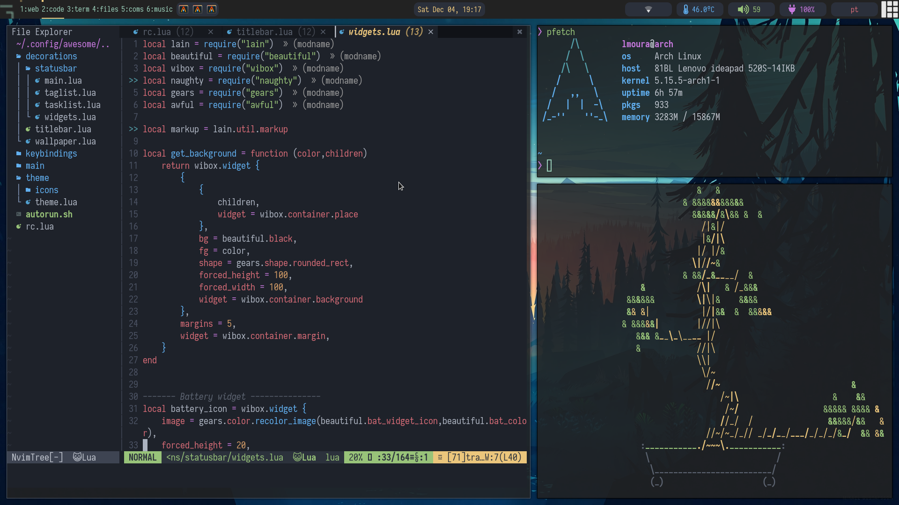

# dotfiles

My UNIX configuration files. The structure of this repository follows the structure of my own home folder.

## Screenshot

## Configuration 

I currently run the Arch linux distribution using AwesomeWM using the following configuration:

- **Operating System:** [Arch Linux](https://www.archlinux.org/)
- **Window Manager:** [Awesome Window Manager](https://awesomewm.org/)
- **Browser:** [Firefox](https://www.mozilla.org/en-US/firefox/new/)
- **Shell:** [Zsh](https://www.zsh.org/) using [Oh-my-zsh](https://ohmyz.sh/)
- **Terminal:** [Alacritty](https://github.com/alacritty/alacritty)
- **Text Editors:** [VSCode](https://code.visualstudio.com/) and [NeoVim](https://neovim.io/)
- **File Manager:** [Nemo](https://github.com/linuxmint/nemo) and [Ranger](https://github.com/ranger/ranger)
- **Image viewer:** [Feh](https://feh.finalrewind.org/)
- **Video player:** [VLC](https://www.videolan.org/vlc/)
- **Pdf viewer:** [Xreader](https://github.com/linuxmint/xreader/) and [Zathura](https://pwmt.org/projects/zathura/)
- **App launcher:** [Rofi](https://github.com/davatorium/rofi)
- **Icon theme:** [Papirus](https://github.com/PapirusDevelopmentTeam/papirus-icon-theme)
- **Compositor:** [Picom](https://github.com/yshui/picom)
- **Sound:** [Alsamixer](https://wiki.archlinux.org/index.php/Advanced_Linux_Sound_Architecture#Unmuting_the_channels) and [Pulseaudio](https://wiki.archlinux.org/index.php/PulseAudio)
- **Networking:** [NetworkManager](https://wiki.gnome.org/Projects/NetworkManager/) using [nm-applet](https://www.archlinux.org/packages/?name=network-manager-applet) as a frontend
- **Bluetooth:** [Bluez](http://www.bluez.org/) using [Blueman](https://github.com/blueman-project/blueman) as a frontend
- **Touchpad drivers:** [Libinput](https://freedesktop.org/wiki/Software/libinput/) using [Xinput](https://wiki.archlinux.org/index.php/Libinput#Configuration) for configuration
- **Screen backlight:** [Xbacklight](https://www.archlinux.org/packages/?name=xorg-xbacklight)
- **Multi Screen:** [Xrandr](https://wiki.archlinux.org/index.php/Xrandr) with [ARandR](https://christian.amsuess.com/tools/arandr/) as frontend.
- **GTK theme:** [Arc-Dark](https://github.com/jnsh/arc-theme)
- **GTK theme selector:** [Lxappearance](https://wiki.lxde.org/en/LXAppearance)
- **WM Icons:** [FontAwesome](https://fontawesome.com/)
- **System Font**: [NerdFonts Iosevka](https://www.nerdfonts.com/)

## Config folder

This folder stores most configurations, divided in subfolders, each one for a separate package configuration.

## Other files

Other dotfiles should be placed directly in the `/home` folder as they often deal with configurations that only require a single configuration file.

--- 

**Note**: If you find some mistake in this readme or any other part of this repo, feel free to tell me about it!
